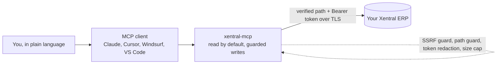

# xentral-mcp

Talk to your Xentral ERP in plain language from Claude and other MCP clients. Ask for a customer, a product, an open invoice, or a sales order, and get the answer back without opening the Xentral UI or writing an API call.


> Works with Xentral®. This is an independent and unofficial connector. It is not affiliated with, endorsed by, or supported by Xentral. See the [trademark notice](docs/TRADEMARKS.md).
>
> Licensing in one line. This is NOT MIT and it is NOT free for business. An individual may test it for free, with visible credit. Any business or commercial use needs prior written approval from the author. It is provided as is, with no warranty and no liability, you run it at your own risk. Read the [LICENSE](LICENSE) before you use it.
>
> No AI cloning. Using an AI to clone, reimplement, or recreate this project is a derivative work that needs the author's written consent, see [AGENTS.md](AGENTS.md). If you want it for a business, or configured for you, contact the author through next8n.com.

## What you get

- Answers from your live ERP inside your AI client. "Show me the last five sales orders" returns real rows, no tab switching.
- Local and platform agnostic. It runs on your own machine over stdio, on macOS, Linux, or Windows, with no cloud account and no vendor lock in. The install pulls only the MCP SDK, dotenv, and zod, nothing cloud specific. A hosted deployment is an optional convenience, never a requirement.
- Read by default, with a guarded write path. Writes are off until you turn them on, so an agent can look but changes nothing until you allow it.
- Correct paths, not guessed ones. Every tool points at a verified endpoint from the Xentral OpenAPI specs, including the traps a naive build gets wrong (delivery notes, not the shipment level `deliveries` path).
- Reach any of 548 operations. 41 tools cover the common cases across the order to cash and procure to pay flows plus webhooks, including named write actions for creating orders, invoices, products, customers, shipments, and goods receipts. When you need something rarer (accounting, tax, POS), the finder tool locates the exact path and a guarded generic request calls it.
- Token lean output. Responses strip empty fields so a large result does not flood your context. Ask for `verbose` when you want the full payload.
- One command setup. `xentral-mcp setup` wires your client, checks your token against the live instance, and backs up your existing config first.

## Payoff walk, from nothing to the first answer

1. Create a Personal Access Token in Xentral under Account settings, Developer Settings, Personal Access Tokens. Copy it once, it is shown only at creation.
2. Run the setup command and paste your instance URL and token.

   ```bash
   npx xentral-mcp setup
   ```

3. Restart your client (Claude Desktop, Claude Code, Cursor, Windsurf, or VS Code).
4. Ask a question. "List the first five products from Xentral." You have your first answer.

Confirm health any time.

```bash
npx xentral-mcp doctor
```

## What it looks like in practice

You ask in plain language. The connector calls the verified endpoint, attaches your token over TLS, and hands back real rows. No tab switching, no API code.

```text
You:  Show me the last three sales orders from Xentral.

xentral-mcp  ->  GET /api/v1/salesOrders   (verified path, read only, token attached)

Claude:
  #  Order      Customer          Date         Net        Status
  1  SO-10482   Muster GmbH       2026-07-06   1,240.00   released
  2  SO-10481   Beispiel AG       2026-07-05     380.50   open
  3  SO-10480   Test Handel KG    2026-07-05   2,905.00   shipped
```

Turn writes on and the same plain language creates records, behind the guards.

```text
You:  Create a sales order for customer 4471, 3 units of SKU A-100.

xentral-mcp  ->  POST /api/v1/salesOrders/actions/import   (write path, only when you enable it)

Claude:  Done. Order SO-10483 created, status open. Want me to release it?
```

How the pieces fit together.



## Who is this for

Agencies and operators who run Xentral for DACH commerce and want an AI assistant that can read the ERP safely. The tooling is source-available. An individual may test it for free with credit. Any business or commercial use needs prior written approval from the author, see the [LICENSE](LICENSE). The value is a grounded, correct, guard-rail-wrapped integration that a stranger can install in five minutes, and a paid service that will stand it up for your business.

## Can I self-host Xentral and point this at it?

No. Modern Xentral is cloud-only, and the only self-hostable option is OpenXE, the old community fork, which speaks a different API generation (HTTP Digest, not Bearer). This MCP cannot talk to it. If that is what you were about to try, read the full write-up first and save yourself the time, see [xentral-self-hosting-lessons](https://github.com/mjmirza/xentral-self-hosting-lessons). Use a modern Xentral cloud account with a Personal Access Token for this MCP.

## Tools in this version

26 named read tools, 12 named write tools (off until you enable writes), 2 spec inventory helpers, and 1 guarded generic request. 41 in total.

### Read tools

| Tool | Reads | Path |
|------|-------|------|
| `xentral_list_products` | products | `GET /api/v2/products` |
| `xentral_get_product` | one product | `GET /api/v2/products/{id}` |
| `xentral_get_product_stock` | stock for one product | `GET /api/v1/products/{id}/stocks` |
| `xentral_get_product_sales_prices` | sales prices for one product | `GET /api/v1/products/{id}/salesPrices` |
| `xentral_list_customers` | customers | `GET /api/v2/customers` |
| `xentral_get_customer` | one customer | `GET /api/v2/customers/{id}` |
| `xentral_list_sales_orders` | sales orders | `GET /api/v1/salesOrders` |
| `xentral_get_sales_order` | one sales order | `GET /api/v1/salesOrders/{id}` |
| `xentral_list_invoices` | invoices | `GET /api/v1/invoices` |
| `xentral_get_invoice` | one invoice | `GET /api/v1/invoices/{id}` |
| `xentral_get_invoice_balance` | balance for one invoice | `GET /api/v1/invoices/{id}/balance` |
| `xentral_get_invoice_documents` | document and PDF references for one invoice | `GET /api/v1/invoices/{id}/documents` |
| `xentral_list_purchase_orders` | purchase orders | `GET /api/v1/purchaseOrders` |
| `xentral_get_purchase_order` | one purchase order | `GET /api/v1/purchaseOrders/{id}` |
| `xentral_list_delivery_notes` | delivery note documents | `GET /api/v1/deliveryNotes` |
| `xentral_get_delivery_note` | one delivery note | `GET /api/v1/deliveryNotes/{id}` |
| `xentral_get_delivery_note_shipments` | shipments for one delivery note | `GET /api/v1/deliveryNotes/{id}/shipments` |
| `xentral_list_suppliers` | suppliers | `GET /api/v1/suppliers` |
| `xentral_get_supplier` | one supplier | `GET /api/v1/suppliers/{id}` |
| `xentral_list_webhooks` | webhooks | `GET /api/v1/webhooks` |
| `xentral_get_webhook` | one webhook | `GET /api/v1/webhooks/{id}` |
| `xentral_list_webhook_event_types` | webhook event types | `GET /api/v1/webhookEventTypes` |
| `xentral_list_domains` | the API areas and their counts | bundled inventory |
| `xentral_find_endpoint` | any of 548 operations by keyword | bundled inventory |
| `xentral_request` | a guarded request against any spec present path | guarded generic |

There is no global stock list in the Xentral API, so `xentral_get_product_stock` reads stock per product and needs a product id. Sales orders, invoices, and purchase orders use the stable V1 reads. Each tool description names the newer V3 form.

### Write tools

These are the write actions integration users reach for most. We picked them by scouting the real Xentral connectors (the Make.com app, the n8n community node, the older n8n node), where the same core keeps appearing, then cross checked every path against the bundled spec so each tool points at a real operation. Every write tool is OFF by default. It returns a clear error and never calls the API unless the server starts with `XENTRAL_MCP_READONLY=false`. None of them use DELETE.

| Tool | Does | Path |
|------|------|------|
| `xentral_create_sales_order` | import a new sales order (the action every shop and marketplace push uses) | `POST /api/v1/salesOrders/actions/import` |
| `xentral_release_sales_order` | release an order for fulfillment | `PATCH /api/v3/salesOrders/{id}/actions/release` |
| `xentral_send_sales_order` | send the order document to the customer | `PATCH /api/v3/salesOrders/{id}/actions/send` |
| `xentral_cancel_sales_order` | cancel an order | `POST /api/v1/salesOrders/{id}/actions/cancel` |
| `xentral_set_product_stock` | set the absolute stock at a storage location | `PATCH /api/v1/storageLocations/setTotalStock` |
| `xentral_create_shipment` | record a shipment with tracking | `POST /api/v1/shipments` |
| `xentral_create_invoice` | create an invoice | `POST /api/v1/invoices` |
| `xentral_create_credit_note` | create a credit note for a refund or correction | `POST /api/v1/creditNotes` |
| `xentral_create_product` | create a product | `POST /api/v2/products` |
| `xentral_create_customer` | create a customer (an address with the customer role) | `POST /api/v2/customers` |
| `xentral_create_purchase_order` | create a purchase order to a supplier | `POST /api/v1/purchaseOrders` |
| `xentral_receive_goods` | record a goods receipt against a purchase order | `POST /api/v1/purchaseOrders/{id}/goodsReceipts` |

Two traps worth stating plainly. First, `xentral_set_product_stock` sets an absolute quantity, it is not a delta and it is not a movement booking, because the API has no separate stock movement transaction endpoint. Second, `xentral_create_shipment` records tracking, it does not print a carrier label, because the API has no public label generation call. Use `xentral_get_delivery_note_shipments` to read back what was recorded.

The named write tools run on the local stdio server, where you control the write flag on your own machine. The hosted worker keeps writes off, so the multi-tenant path stays read only.

### The guarded generic request

`xentral_request` reaches the operations the named tools do not cover, under a strict guard.

- GET is always allowed. POST, PATCH, and PUT are allowed only when the server starts with `XENTRAL_MCP_READONLY=false`. DELETE also needs `XENTRAL_MCP_ALLOW_DELETE=true`.
- A disallowed method returns a structured error and never calls the API.
- The path must be relative, start with `/api/`, and be present in the spec for that method. Full URLs, protocol relative forms, and path traversal are refused (SSRF guard). The Bearer token is attached automatically and never logged.
- On a 429 rate limit the request retries once after a short backoff.

Writes are off by default for a real reason. A PATCH on a sales order replaces its full line item list, so any line item left out of the body is removed. A caller must send the existing line item ids to keep them. Read stays the safe default, and a write is a deliberate choice you opt into.

## Configuration

Set these in your client config or a local `.env`.

| Variable | Meaning |
|----------|---------|
| `XENTRAL_API_URL` | Full instance host, for example `https://acme.xentral.biz`. No version segment. A bare host with no scheme gets `https` added. |
| `XENTRAL_ID` | Instance id only, expands to `https://<id>.xentral.biz`. Use one of the two. |
| `XENTRAL_TOKEN` | Personal Access Token. Never commit it. Never paste it into a chat. |
| `XENTRAL_MCP_READONLY` | Read guard. Default 1, read only. Set to `false` to allow POST, PATCH, and PUT through the generic tool. |
| `XENTRAL_MCP_ALLOW_DELETE` | Default `false`. Set to `true`, together with readonly `false`, to allow DELETE. |
| `XENTRAL_MCP_TIMEOUT_MS` | Per request timeout in milliseconds. Default 30000. |
| `XENTRAL_MAX_RESPONSE_CHARS` | Character cap for formatted output. Default 20000. |

Where your token lives. The setup command writes it into your chosen client config file on your machine, and nowhere else. The token reaches only your Xentral instance over TLS.

## Manual wiring

If your client is not in the known list, print the config block and paste it yourself.

```bash
npx xentral-mcp setup --print
```

For CI or a scripted install, drive it with flags.

```bash
npx xentral-mcp setup --yes --url https://acme.xentral.biz --token "$XENTRAL_TOKEN" --client cursor
```

## Local development

```bash
npm install
npm run typecheck
npm run build
npm run smoke
```

The smoke test starts the built server over stdio and asserts every tool registers. It makes no live Xentral call.

## Safety

- Read by default. Writes stay off unless the server starts with `XENTRAL_MCP_READONLY=false`, and DELETE also needs `XENTRAL_MCP_ALLOW_DELETE=true`.
- Method guard. A disallowed method returns a structured error and never calls the API.
- Path guard. The generic tool accepts a relative `/api/` path only, rejects a full URL, protocol relative form, and path traversal, and refuses any path that is not present in the spec for the method (SSRF guard).
- Secret hygiene. The token is never logged, and any occurrence in an error body is redacted.
- Tokens at rest. On the hosted path the token is encrypted with AES-256-GCM before storage, never persisted in plain text.

The full posture, the threat model, encryption at rest, the SSRF and path defenses, and the responsibilities that stay with you are documented in the [security policy](.github/SECURITY.md).

## Hosted option

The default and recommended way to run this is the local stdio server on your own machine, which is bound to no platform. If you would rather not run it locally, a hosted Cloudflare Worker is one alternative (the one the author uses). It speaks the MCP Streamable HTTP transport, offers a Personal Access Token header method for direct calls, and an OAuth consent flow that signs a person in once. Both methods store the tenant token encrypted at rest with AES-256-GCM, so the raw token is never persisted. The whole hosted path is tested end to end against a real instance in the local Cloudflare runtime, both connection methods, the full OAuth flow, encryption at rest, and endpoint protection. See `docs/PROJECT_STRUCTURE.md` for the detail.

## Testing

The test surface is stated plainly, without inflation.

- Unit tests over the pure modules and the write gate, 163 cases, run with the Node built-in test runner. Function coverage is 100 percent and line coverage is 99.78 percent. The one line the tool counts as missed is a type-only declaration that carries no runtime.
- An offline adversarial suite, 33 cases, that proves the SSRF, path, read only, and delete guards, opens and closes the write and delete paths, and shows hostile input never crashes the server or leaks the token.
- An MCP protocol conformance suite, 7 cases, over all 41 tools.
- A worker suite, 15 cases, over the crypto, the consent page, and the config helpers.
- A live endpoint sweep that calls every one of the 194 GET operations against a real instance and reports each one. Zero client side errors were found. A handful of accounting endpoints return a server side 500 on the demo instance because that module is not provisioned there, which the sweep records as an upstream fault, not a client fault.
- A live stress suite, 32 cases, over pagination bounds, the 100 per minute rate limit and the 429 handling, response truncation, and request timeout.

Run the offline bundle with `npm test`. It covers smoke, unit, protocol, worker, and aggression, and makes no live call. Run the live bundle with `npm run test:live`, which covers live, live write, sweep, and stress, and needs a real token and instance URL in the environment. The individual scripts `test:unit`, `test:aggression`, `test:protocol`, `test:worker`, `test:sweep`, `test:stress`, `live`, `live:write`, and `smoke` also exist.

## Need this set up for your business?

If you run Xentral and you want this connected to your own instance, or extended to your exact workflow, Nexus AI can do the setup for you. This is the paid installation and integration service behind the open tooling here. What that covers, numbered.

1. Managed install and wiring. Nexus AI connects the server to your Xentral instance, verifies the token live, and wires it into your client of choice, Claude, Cursor, or any MCP client, so your team starts asking questions on day one instead of reading setup docs.

2. Custom tools for your flow. The 41 tools here are the common cases. Nexus AI adds named tools for the exact endpoints you run every day, from the 548 in the spec, with the right pagination, the right content type, and the traps handled for you.

3. Writes turned on safely. Creating orders, invoices, shipments, and goods receipts is off by default for good reason. Nexus AI enables the write actions you actually need, behind the same read only and delete guards, with a short review of the line item replace behavior so a PATCH never drops what you meant to keep.

4. Hosted deployment. If you would rather not run a local server, Nexus AI deploys the hosted Cloudflare Worker, with the OAuth sign in and the token encrypted at rest, so your whole team connects over one URL.

5. Guardrails and monitoring. SSRF and path guards, token redaction, rate limit handling, and a health check, plus the deep test suite above, so the thing that touches your ERP is one you can trust.

6. Handover and training. A short session with your team on how to ask for orders, stock, invoices, and the rest in plain language, and a written runbook you keep.

Want this installed, or a custom build on top? Reach out through next8n.com, describe your instance and the flows you care about, and Nexus AI will scope it with you.

## Project structure

See `docs/PROJECT_STRUCTURE.md` for the folder layout, the hosted deployment, the write phase, and the cost model.

## License and credit

Source-available under the [Xentral-MCP Source-Available License](LICENSE). This is not MIT and not open source. In short.

- An individual may download, run, and test it for free, with visible credit to the author.
- Business use, production use, and any commercial deployment need prior written approval from the author. Request it through next8n.com.
- Credit is mandatory in every use. Keep the copyright line and the notices intact.
- Provided as is, with no warranty and no liability. You run it at your own risk, and every action an agent takes against your data is your responsibility.

"Xentral" is a trademark of its owner. This project is independent, unofficial, and not endorsed by Xentral. See [trademarks and attribution](docs/TRADEMARKS.md).
